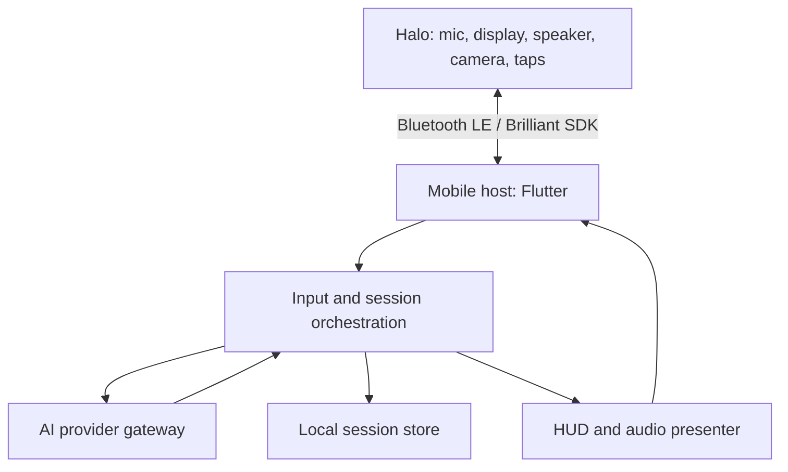

# Halo AI Interface — Alpha 0.2

Initial architecture for a voice and heads-up AI interface using **Brilliant Labs Halo** glasses. The target experience is a spoken question, a concise response on the display, optional spoken output, and a user-controlled session record.

> Hardware assumption: “Halo” means [Brilliant Labs Halo](https://brilliant.xyz/products/halo). A different Halo device requires a different hardware adapter.

The phone owns connection, permissions, capture, request state, HUD formatting and local storage. Halo runs a small Lua event handler and exposes hardware through the [Brilliant SDK](https://docs.brilliant.xyz/halo/halo-sdk/). The AI gateway holds provider secrets and mediates requests. The initial provider target is OpenAI behind a replaceable interface.

## First vertical slice

1. Connect over Bluetooth with the official Flutter SDK and render a status card.
2. Start bounded voice capture on deliberate tap/button action; show listening and processing states, cancellation and disconnect recovery.
3. Send audio to the gateway for transcription and response generation; show a short text answer. Add spoken output after text works.
4. Save an opt-in session record with timestamp, question and answer, with review and deletion on the phone.
5. Add optional camera questions only with a separate explicit capture action and visible indication.

See [architecture](docs/architecture.md), [contracts](docs/contracts.md), and [milestones](docs/milestones.md).

**Status:** Architecture scaffold only. Bluetooth, AI, camera and audio integrations have not been implemented or verified on physical Halo hardware. The ChatGPT consumer app is not assumed to have a direct glasses HUD API.

Sources: [Halo hardware](https://docs.brilliant.xyz/halo/hardware/), [Halo SDK](https://docs.brilliant.xyz/halo/halo-sdk/), [official SDK repository](https://github.com/brilliantlabsAR/brilliant_sdk).
