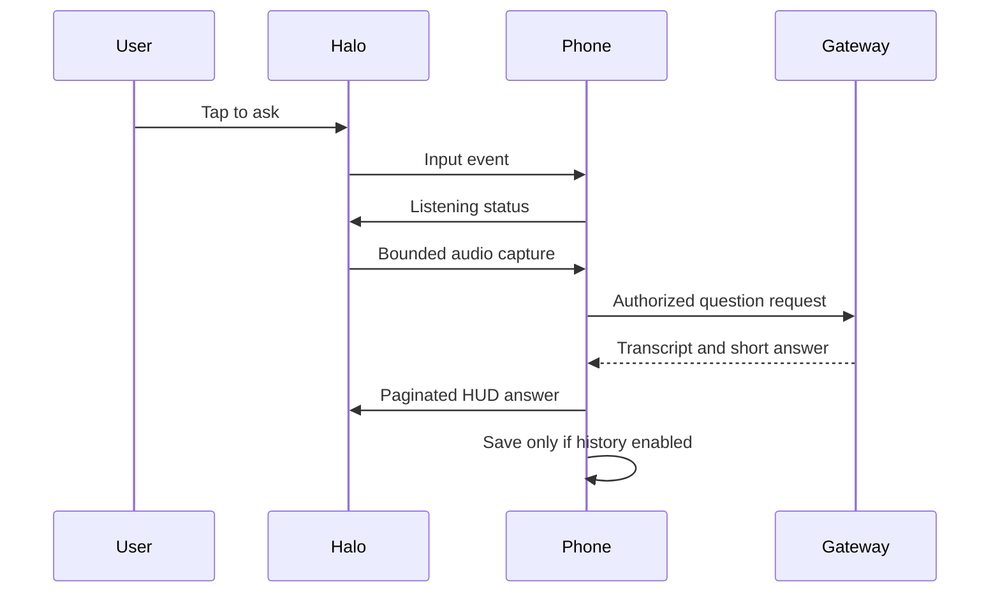

# Architecture decision 001: Brilliant Labs Halo host app

## Scope

“Halo” is assumed to mean Brilliant Labs Halo, distinct from Even Realities G2/B, Halo Glass software and the CAMEL-AI HALO bridge. Brilliant's [documentation](https://docs.brilliant.xyz/halo/halo-sdk/) describes Halo as a Bluetooth peripheral controlled by a host app. The SDK supports Flutter on Android/iOS, Python on desktop and Web Bluetooth. The [hardware](https://docs.brilliant.xyz/halo/hardware/) includes a color display, microphones, bone conduction audio, camera, tap sensing and a button. Lua scripts run on the device; intensive orchestration stays on the host.

| Component | Responsibility | Initial choice |
| --- | --- | --- |
| Halo adapter | Pair, reconnect, receive input/audio, send display/audio | Flutter `brilliant_sdk`; pin a tested version |
| Interaction controller | Idle/listening/processing/presenting/error, cancel and timeout | Pure Dart state machine |
| Capture | Permissions, deliberate activation, transient audio | Mobile app; no passive recording |
| AI gateway | Authenticate, rate limit, transcribe, answer, optional speech | HTTPS service; provider secrets on server |
| HUD presenter | Trim and paginate text, progress and source cues | Small cards; phone fallback |
| Session store | Opt-in history, retention, deletion | Local encrypted storage after threat review |

## Boundaries and decisions

- Isolate SDK types behind `HaloDevicePort`; the rest of the app consumes normalized events. Isolate the model behind `AssistantPort`.
- Keep permanent API keys off the phone and Lua device. Use TLS, user authentication, scoped credentials and usage limits at the gateway.
- Audio and images are ephemeral by default. Camera use needs a separate action and visible capture indication. History is off until enabled, and can be deleted.
- Put detailed answers, consent and history management on the phone; the HUD shows brief cards.
- Cancel capture on disconnect. Match responses by request ID to discard late answers.
- Defer background listening and domain-specific assistants until the hardware loop is verified.

## Open decisions

1. Confirm exact Halo model and first host platform (Android is proposed).
2. Validate SDK audio transport, firmware compatibility, permissions and real device latency.
3. Select gateway deployment, account authentication and retention policy.
4. Measure battery drain, display legibility and disconnect behavior.

References: [hardware](https://docs.brilliant.xyz/halo/hardware/), [SDK guide](https://docs.brilliant.xyz/halo/halo-sdk/), [official SDK source](https://github.com/brilliantlabsAR/brilliant_sdk).
